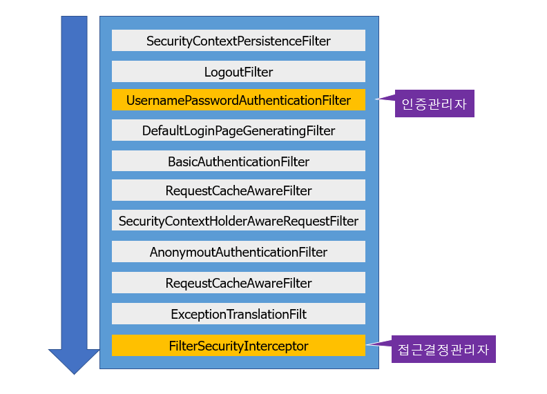
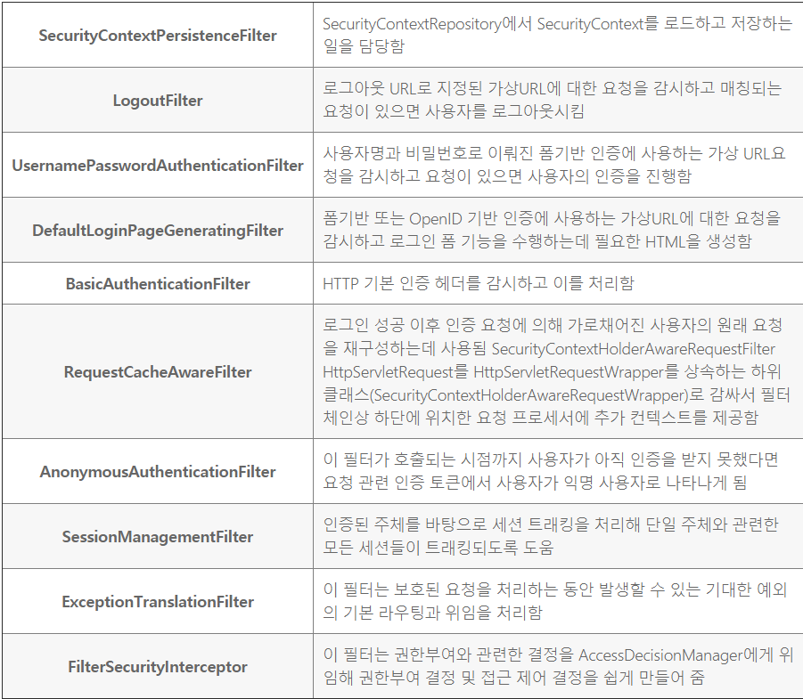
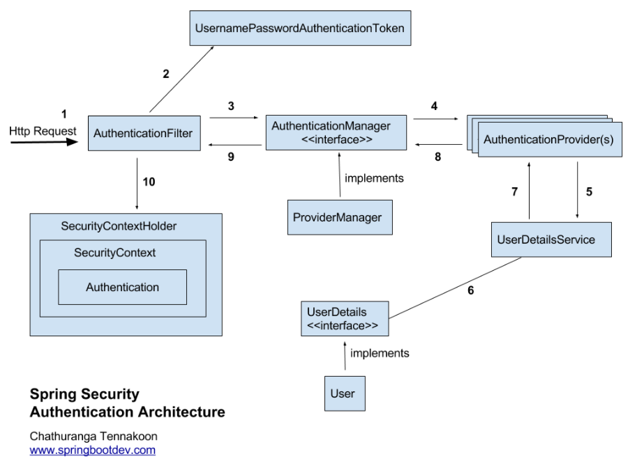

참조문서
- https://springbootdev.com/category/spring-security/
- https://sjh836.tistory.com/165
- https://devuna.tistory.com/55

# 스프링 시큐리티란?
- 스프링 기반의 애플리케이션의 보안(인증과 권한,인가 등)을 담당하는 스프링 하위 프레임워크
- 즉, 인증(Authenticate, 누구인지?)과 인가(Authorize, 어떤 것을 할 수 있는지)를 담당하는 프레임워크를 말함
- 스프링 시큐리티는 주로 서블릿 필터(filter)와 이들로 구성된 필터체인으로의 구성된 위임모델을 사용함.
- 그리고, 보안과 관련해서 체계적으로 많은 옵션을 제공해주기 때문에 개발자 입장에서는 일일이 보안관련 로직을 작성하지 않아도 된다는 장점 O

### 기본용어
- 접근주체(Principal) : 보호된 리소스에 접근하는 대상
- 인증(Authentication) : 보호된 리소스에 접근한 대상에 대해 누구인지, 애플리케이션의 작업을 수행해도 되는 주체인지 확인하는 과정(ex. form 기반 로그인) -> 누구인지?
- 인가(Authorize) : 해당 리소스에 대해 접근 가능한 권한을 가지고 있는지 확인하는 과정(After Authentication,  인증 이후) -> 어떤 것을 할 수 있는지?
- 권한 : 어떠한 리소스에 대한 접근 제한, 모든 리소스는 접근 제어 권한이 걸려있음. 인가 과정에서 해당 리소스에 대한 제한된 최소환의 권한을 가져있는지 확인

# 스프링 시큐리티 특징과 구조
- 보안과 관련하여 체계적으로 많은 옵션을 제공하여 편리하게 사용할 수 있음
- Filter 기반으로 동작하여 MVC와 분리하여 관리 및 동작
- 어노테이션을 통한 간단한 설정
- Spring Security는 기본적으로 세션 & 쿠키 방식으로 인증
- 인증관리자(Authentication Manager)와 접근 결정 관리자(Access Decision Manager)를 통해 사용자의 리소스 접근을 관리
- 인증 관리자는 UsernamePasswordAuthenticationFilter, 접근 결정 관리자는 FilterSecurityInterceptor가 수행

# 인증관련 아키텍처

